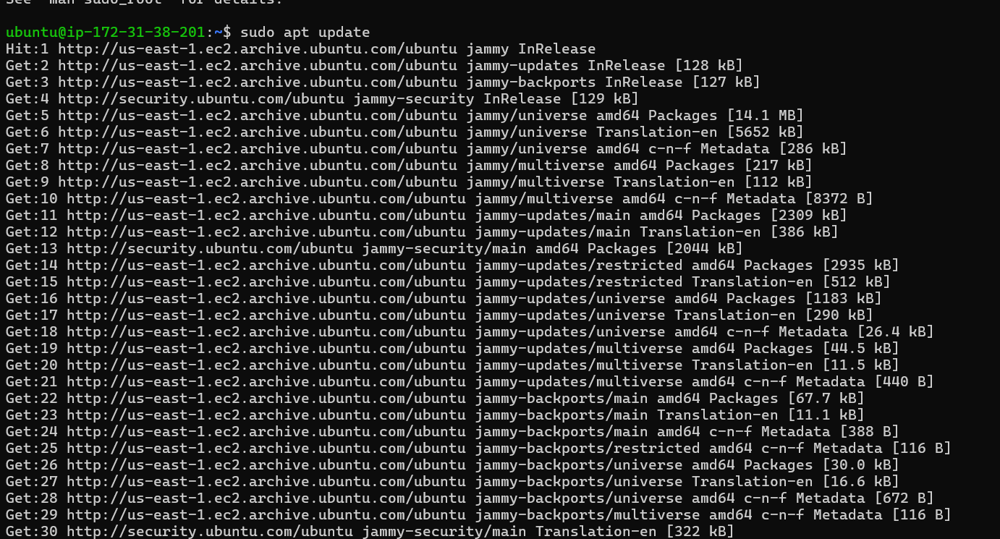
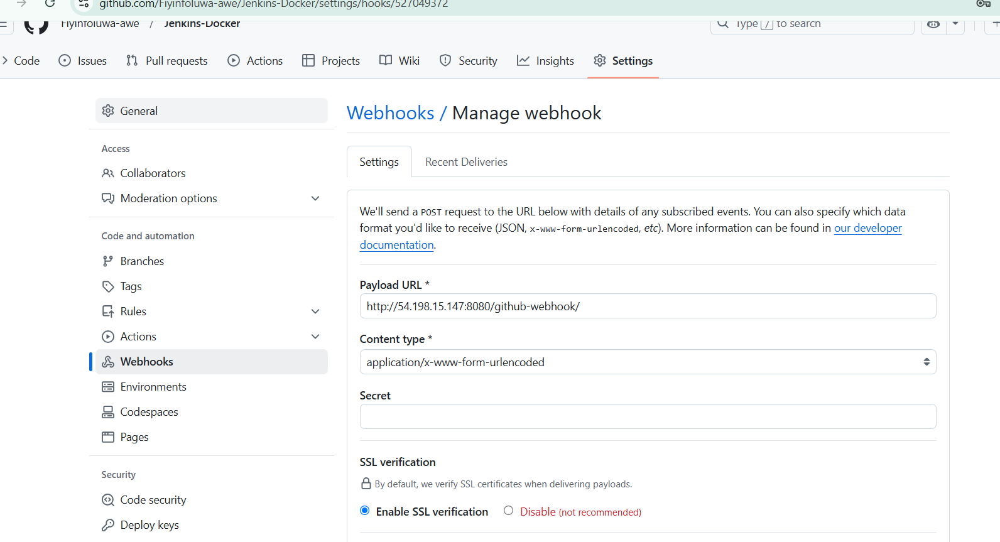
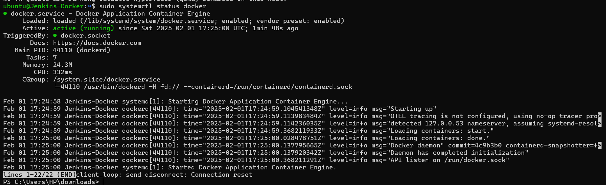

# CI/CD-Mastery

 ### Project Scenario 
 ---
A  technology consulting firm wants to adopt a cloud architecture for its software applications. As a DevOps Engineer, your task is to design and implement a robust and CI/CD pipe line using Jenkins to automate the deployment of a web application. The goal is to achieve continuous integration, continuous deployment and ensure the stability and reliability of the applications.

### Pre-requisite
---

* Knowledge of Jenkins essentials
* Completion of Introduction to Jenkins, Jenkins Freestyle Project,and Jenkins Pipeline Jobs mini projects


## Jenkins Server Setup 


Updating package repositories

`sudo apt update`



Installing JDK

`sudo apt install openjdk-11-jdk`


Check if jenkins has been installed, and it is up and running

`sudo systemctl status jenkins`


On my Jenkins instance, create new inbound rule for this in the security group of our jenkins instance.


## Setting up Jenkins on The Web Console 

Inputted my Jenkins Instance IP address on my web browser 

`http://<ip_address>:8080`

.jpg>)

On my Jenkins instance, check `var/lib/jenkins/initialAdminPassword` to know my password.


Installed suggested plugins


Created a user account (first admin user)


logged into my jenkins console 


## Source Code Management Respository Integration 

Connecting Jenkins to the version control system for source code management.
 
 Created a new Github Repository  called it `Jenkins-Docker` with a README.md file

 .jpg>)

Integrating Jenkins with the source code management repository, in my case Github

Configuring webhooks to automate the trigerring of Jenkins builds
(provide intructions for setting up webhooks)




## Jenkins Freestyle Jobs for Build and Unit Tests

Created Jenkins Freestyle jobs for building a web application and running unit tests.
On the dashboard menu on the left side, clicked on `new item`


Created my freestyle project 


named it **`my-first-job`**

Connecting Jenkins with  my github repository by pasting the repository url in configuration of the freestyle project, making sure that current branch is `main`.


## Configuring Build Trigger

As a engineer, we need to be able to automate things and make our work easier in possible ways. I have connected ***'Jenkins'*** to ***'Jenkins-Docker'*** repository, but i have cannot run a new build with clicking on ***'Build Now'***. To eliminate this, I need to configure a build tigger to my jenkins job. With this, jenkins will run a new build anytime a change is made to my github repository.

Click ***'Configure'*** on my job and add this configurations.

Click ***'Build Triggers'*** to configure tiggering the job from Github webhook.


 Created a Github webhook using Jenkins ip address and port


I can now effect any change in any file in my Github repository, I effect a change in my README.md file and pushed it to my main branch.

 .jpg>)

A new build was successfully launched automatically by webhook.


(Set up a Freestyle job for building the application)
( Document the configuration of Freestyle jobs)


## Jenkins Pipeline for Web Application

 I developed a Jenkins Pipeline for running a web application 

Firstly, created a Jenkins Pipeline script to run a web application, by clicking on ***'new item'*** on the left side of the dashboard.


Like earlier done in my freestyle project, creating a build trigger for Jenkins to trigger new build;

* Clicked on ***'Configure'*** on my job, adding configurations.

* Clicked on ***'Build Trigger'*** to configure triggering the job from Github webhook. Since a webhook was created earlier for my freestyle project, there is no need creating another one.


### Writing Jenkins Pipeline Script 

A jenkins pipeline script  refers to a script that defines and orchestrates the steps and stages of a continuous integration and continuous delivery (CI/CD) pipeline. Jenkins pipeline can be defined using either declarative or scripted syntax. Declarative syntax is a more structured and concise way to define pipelines. It uses a domain-specific language to describe the pipeline stages, steps, and other configurations while scripted syntax provides more flexibility and is suitable for complex scripting requirements.

Let's write our pipeline script 


```
pipeline {
    agent any

    stages {
        stage('Connect To Github') {
            steps {
                    checkout scmGit(branches: [[name: '*/main']], extensions: [], userRemoteConfigs: [[url: 'https://github.com/Fiyinfoluwa-awe/Jenkins-Docker.git']])
            }
        }
        stage('Build Docker Image') {
            steps {
                script {
                    sh 'docker build -t dockerfile .'
                }
            }
        }
        stage('Run Docker Container') {
            steps {
                script {
                    sh 'docker run -itd -p 8081:80 dockerfile'
                }
            }
        }
    }
}
```


#### Explanation of the script above  
The provided Jenkins pipeline script defines a series of stages for a continuous integration and continuous delivery **{CI/CD}** process. Let's breakdown each stage:

* **Agent Configuration**

        `agent any`

Specifies that the pipeline can run on any available agent {an agent can either be a jenkins master or node}. This means the pipeline is not tied to a specific node type.

* **Stages**

```
stages \{
   // Stages go here
\}
```
Defines the various stages of the pipeline, each representing a phase in software delivery process.


* **Stage 1: Connect To Github:**

```
stage('Connect To Github') {
   steps {
      checkout scmGit(branches: [[name: '*/main']], extensions: [], userRemoteConfigs: [[url: 'https://github.com/Fiyinfoluwa-awe/Jenkins-Docker.git']])
   }
}
```


This stage checks out the source code from my Github repository {`https://github.com/Fiyinfoluwa-awe/Jenkins-Docker.git`}.

It specifies that the pipeline should use the **'main'** branch.


*  **Stage 2: Build  Docker Image**

```
stage('Build Docker Image') {
   steps {
      script {
         sh 'docker build -t dockerfile .'
      }
   }
}
```


This stage builds a Docker image name `dockerfile` using the source code obtained from the Github repository.

The **'docker build'** command is executed using the shell {**'sh'**}


* **Stage 3: Run Dcoker Container:**

```
stage('Run Docker Container') {
   steps {
      script {
         sh 'docker run -itd --name nginx -p 8081:80 dockerfile'
      }
   }
}
```

The stage runs a Docker container named `nginx` in detached mode {**'-itd'**}.

The container is mapped to port 8081 on the host machine {**'-p 8081:80'**}

The Docker image used is the one built in the previous stage {**'dockerfile'**}.

Copy and paste pipeline script and paste it in the section  below


The stage 1 connects Jenkins to my github repository. To generate syntax for my github repository, following this steps below;


Select the drop down to seach for **`checkout: Check out from verison control`**

Pasted my repository url and made sure my branch is main


Genrated my pipeline script 


Now you can replace the generated pipeline syntax for connecting jenkins with github.


## Docker Image Creation and Registry Push 

Before Jenkins can run docker commands, we can need to install docker on the same instance, Jenkins was installed. From shell scripting knowledge, I installed docker with shell script.

*i.* Created a file name **docker.sh**


*ii.** Open the file and pasted the script below 

```
sudo apt-get update -y
sudo apt-get install ca-certificates curl gnupg
sudo install -m 0755 -d /etc/apt/keyrings
curl -fsSL https://download.docker.com/linux/ubuntu/gpg | sudo gpg --dearmor -o /etc/apt/keyrings/docker.gpg
sudo chmod a+r /etc/apt/keyrings/docker.gpg
# Add the repository to Apt sources:
echo \
  "deb [arch=$(dpkg --print-architecture) signed-by=/etc/apt/keyrings/docker.gpg] https://download.docker.com/linux/ubuntu \
  $(. /etc/os-release && echo "$VERSION_CODENAME") stable" | \
  sudo tee /etc/apt/sources.list.d/docker.list > /dev/null
sudo apt-get update -y
sudo apt-get install docker-ce docker-ce-cli containerd.io docker-buildx-plugin docker-compose-plugin -y
sudo systemctl status docker
```


Save and closed the file

Make the file executable

`chmod u+x docker.sh`

And make the file executable 

`./docker.sh`


I have successfully installed Docker



### Building Pipeline Script 
Now that I have installed *docker* on the same instance with *jenkins*, we need to create a dockerfile before we can run our pipeline script. We can not build a docker image without a *'dockerfile'*. In the main branch of my Github repository **'Jenkins-Docker'**;

**i.** Created a new file named **'dockerfile'** 
**ii.** Pasted the code snippet below in the file

```
# Use the official NGINX base image
FROM nginx:latest

# Set the working directory in the container
WORKDIR /usr/share/nginx/html/

# Copy the local HTML file to the NGINX default public directory
COPY index.html /usr/share/nginx/html/

# Expose port 80 to allow external access
EXPOSE 80
```


**iii.** Created an **'index.html'** file and paste the content below

`Congratulations, You have succcessfully run your first pipeline code`


After creating the **'dockerfile'** and **'index.html'**, I pushed them to trigger jenkins to automatically run new build for my pipeline.

I had a few failed build, first was an error and then my  Jenkins pipeline failed at the "Build Docker Image" stage due to a permission error when trying to connect to Docker. This happens because the Jenkins user does not have the right permissions to access the Docker daemon, which I did fix and then had a success build.


To access the content of **'index.html'** on my web browser,  I need to first edit inbound rules and open the port I mapped to my container to (8081)


Now I can now access the content of my **'index.html'** on my web browser.


THE END!


